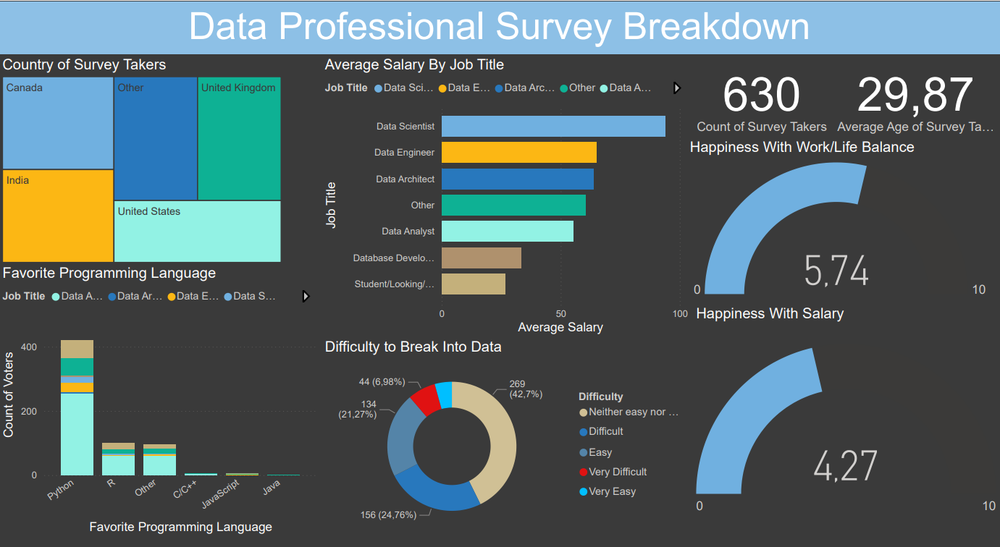

# 📊 Data Industry Survey Dashboard

## 📌 Project Overview  
This project presents an **interactive Power BI dashboard** built from survey data of professionals in the data industry.  
The dataset, collected in Excel, contains responses to questions such as:  
- 🌍 **Country of residence**  
- 💰 **Salary**  
- 🙂 **Job satisfaction**  
- 📈 **Salary satisfaction**  
- 🚪 **Difficulty breaking into data roles**  
- 💻 **Favorite programming language**  

The goal of the dashboard is to **visualize industry trends** and allow users to explore insights dynamically.

---

## 🛠 Tools & Technologies  
- **Power BI** – Data visualization and dashboard design  
- **Excel** – Data storage and initial dataset format  
- **Power Query** – Data cleaning and transformation  

---

## 📂 Dataset  
The dataset originates from a survey conducted among data professionals, compiled in an **Excel (.xlsx)** file.  
It includes demographics, professional background, and career-related opinions.

---

## 🎯 Key Features  
- Interactive visuals with filtering by **country, role, and experience**  
- Insights on **salary ranges** and **job satisfaction levels**  
- Comparison of **favorite programming languages**  
- User-friendly design for quick trend exploration

---

## 📸 Dashboard Preview 

